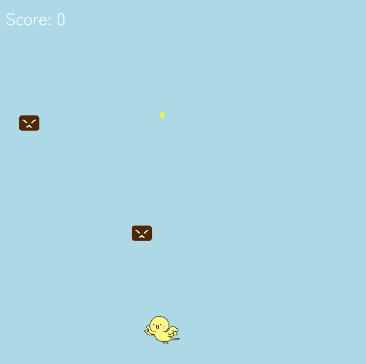
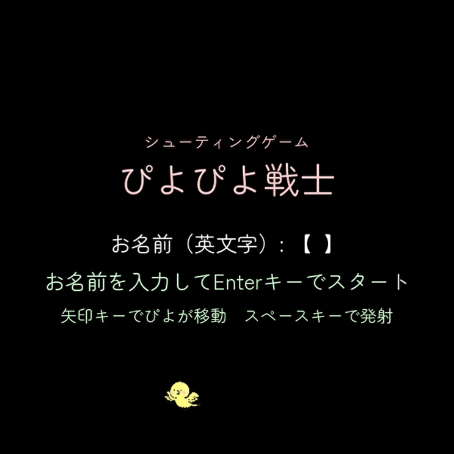

# ぴよぴよ戦士２ 🐥

かわいい「ぴよぴよ」が活躍するシンプルな2Dシューティングゲームです！Pygameを使って作成しています。
ぴよぴよ戦士の一つ目をお友達が学習に利用中なので別フォルダにします。
今回はステージ１～３の構成になっており、１回の攻撃で２点取得でき１０点取れたら、次のステージへと進めます。
今回は音声もついてます。音を出して遊んでみてください♪(ぴよぴよの声は制作者の声です)


## 🎮 ゲーム概要

- プレイヤーは「ぴよぴよ」を操作して敵を撃退！
- スタート画面で名前を入力してゲーム開始。
- 敵を倒すとスコアが増加。ゲームクリア後はタイムランキングも表示されます。

  

## 🎬 ゲームデモ（GIF）

ゲームのプレイデモです！どんな感じで遊べるか見てください。



## 🕹️ 操作方法

 キー           操作内容                          
-------------------------------------------------
 ← / →          左右移動                          
 スペースキー    弾を撃つ                          
 Enterキー    　ゲームスタート（名前入力後）      
 Rキー          再チャレンジ（ゲームオーバー時）  
 Qキー          終了（ゲームクリア時・ゲームオーバー時）
 Yキー          次のステージへ進む         

## 🚀 セットアップ方法

1. **リポジトリをクローン**
   ```bash
   git clone https://github.com/erioonishi/piyopiyosenshi_shootinggame.git
2. **仮想環境の作成（オプション）**
   ```bash
   python -m venv venv
   source venv/bin/activate  # Windowsなら venv\Scripts\activate
3. **依存ライブラリのインストール**
   ```bash
   pip install -r requirements.txt
   ※ requirements.txt がない場合以下のコマンドでPygameをインストールしてください
   pip install pygame
4. **ゲームの起動**
   ```bash
   python main.py

## 📂 ディレクトリ構成

```plaintext
piyopiyo-senshi2/
├── assets/
│   ├── fonts/
│   │   └── Zen_Maru_Gothic/
│   │       └── ZenMaruGothic-Regular.ttf
│   └── images/
│       ├── piyopiyo2.png
│       ├── enemy.png
│       ├── enemy2.png
│       ├── piyo.png
│       └── piyo.gif
│   └── sounds/
│       ├── clear.wav
│       ├── game_over.wav
│       ├── hit.wav
│       └── shoot.wav
├── main.py                # ゲームのエントリーポイント
├── game.py                # ゲームのロジック（スコア管理、ゲームオーバー処理など）
├── player.py              # プレイヤーキャラクターの処理
├── enemy.py               # 敵キャラクターの処理
├── enemy2.py              # 強い敵キャラクターの処理
├── bullet.py              # 弾の処理
├── scores.json            # スコアを保存するJSONファイル
├── times.json             # timeスコアを保存するJSONファイル
└── README.md              # このファイル
```

## 📂 設計図（PDF）Web上での確認のため

- [PDFはこちらから見られます 📄](assets/images/shooting.drawio.pdf)（今回は画面遷移図のみ）

## 💡 今後のアイデア

- アイテムの追加

## 🥺 ライセンス

このゲームは個人の学習目的で作成されたものであり、**商用利用を禁止**しています。  
その他の利用条件については、[LICENSE](./LICENSE) ファイルをご確認ください。

## 🙌 クレジット

- フォント: Zen Maru Gothic
- 音声【hit音とclear音】:効果音ラボ
- フレームワーク：Pygame
- 開発: eri

## 🎀 Special Thanks

- 設計の相談に乗ってくれたtomoyaさん


